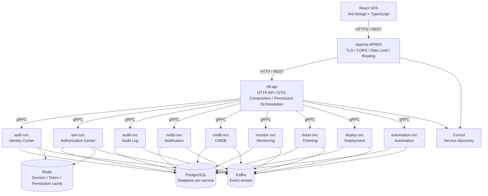

# Operations Platform Architecture

This document set defines the target architecture for the operations platform. It is the source of truth for service boundaries, traffic flow, data ownership, and phase planning.

## Architecture Principles

1. APISIX is the outermost edge gateway and is the only component that accepts client traffic directly.
2. `bff-api` is the client API layer. It exposes HTTP endpoints for the React SPA and orchestrates calls to domain services.
3. Domain services use gRPC for synchronous calls and Kafka events for asynchronous workflows. HTTP endpoints on domain services are kept only for internal compatibility, health checks, or debugging.
4. Each service owns its data. Services may reference foreign identities such as `user_id` and `org_id`, but they must not cross-database JOIN.
5. Authentication and authorization are separated:
   - `auth-svc` answers "who are you?"
   - `iam-svc` answers "what are you allowed to do?"
6. Authorization starts at the platform boundary but domain services can still perform resource-level defensive checks when business rules require them.

## Runtime View

## Request Flow

1. The React SPA calls APISIX with HTTPS.
2. APISIX applies edge policies: TLS termination, CORS, rate limiting, request logging, and route matching.
3. APISIX forwards client API traffic to `bff-api`.
4. `bff-api` validates bearer tokens when needed, builds user context, performs API-level authorization through `iam-svc`, and calls domain services through explicit gRPC clients.
5. Domain services publish business events to Kafka.
6. `audit-svc` and `notify-svc` consume relevant events.

## Document Index

- 简体中文版本: [中文架构文档](zh-CN/README.md)

- [Service Catalog and Boundaries](services.md)
- [Security and Auth Flow](security-and-auth.md)
- [Data Ownership](data-ownership.md)
- [Communication and Events](communication-and-events.md)
- [Deployment and Roadmap](deployment-and-roadmap.md)
