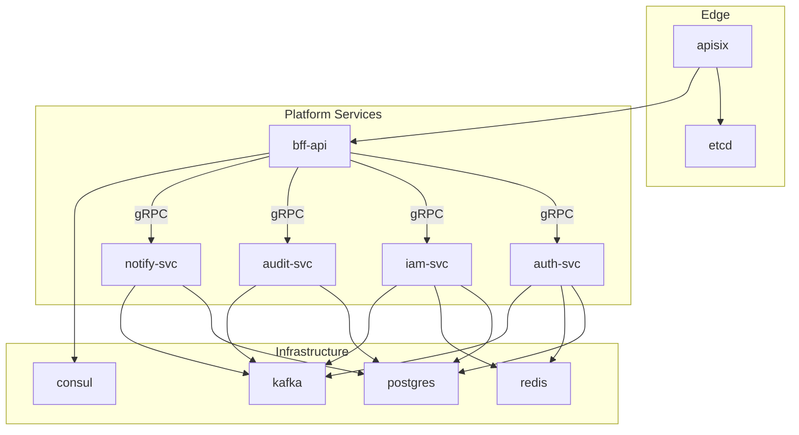

# Deployment and Roadmap

## Deployment Topology

Phase 1 uses Docker Compose. Later phases can move to Kubernetes without changing service boundaries.



## Phase Roadmap

| Phase | Services | Goal |
|---:|---|---|
| 1 | `apisix`, `bff-api`, `auth-svc`, `iam-svc`, `audit-svc`, `notify-svc`, `web` | Identity, authorization, audit, notification, and frontend API foundation. |
| 2 | `cmdb-svc` | Asset and topology management. |
| 3 | `monitor-svc` | Metrics, alert rules, and alert events. |
| 4 | `ticket-svc` | Ticketing, approval workflow, and SLA. |
| 5 | `deploy-svc` | Application release and deployment pipeline orchestration. |
| 6 | `automation-svc` | Script management, batch execution, and scheduled operations. |

## Phase 1 Target Structure

```text
ops-platform/
|-- apisix/
|-- services/
|   |-- bff-api/
|   |-- auth-svc/
|   |-- iam-svc/
|   |-- audit-svc/
|   `-- notify-svc/
|-- pkg/
|   |-- proto/
|   |-- cache/
|   |-- database/
|   |-- jwt/
|   |-- kafka/
|   `-- ...
|-- web/
|-- deploy/
`-- docs/
    `-- architecture/
```

## Docker Compose Status

The Compose topology includes APISIX, BFF, and Phase 1 domain services. Current Phase 1 alignment is:

- `bff-api` is part of the Compose topology and registers through service discovery.
- APISIX routes forward client API traffic to `bff-api`.
- BFF performs authorization orchestration against IAM.
- BFF uses explicit gRPC clients for Phase 1 services.
- `bff-api` and Phase 1 domain services are exposed only inside the Compose network; client traffic enters through APISIX.

## Migration Rule

Client API routes in APISIX route to `bff-api`. Domain-service HTTP endpoints are kept only for internal compatibility, health checks, or debugging. The current target state is:

```text
Client -> APISIX -> bff-api -> gRPC domain services
```

Internal health, metrics, and admin routes can remain service-specific but must not be public client APIs.
