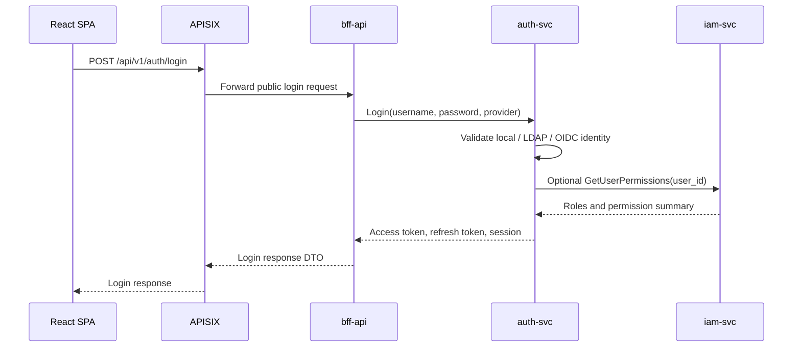
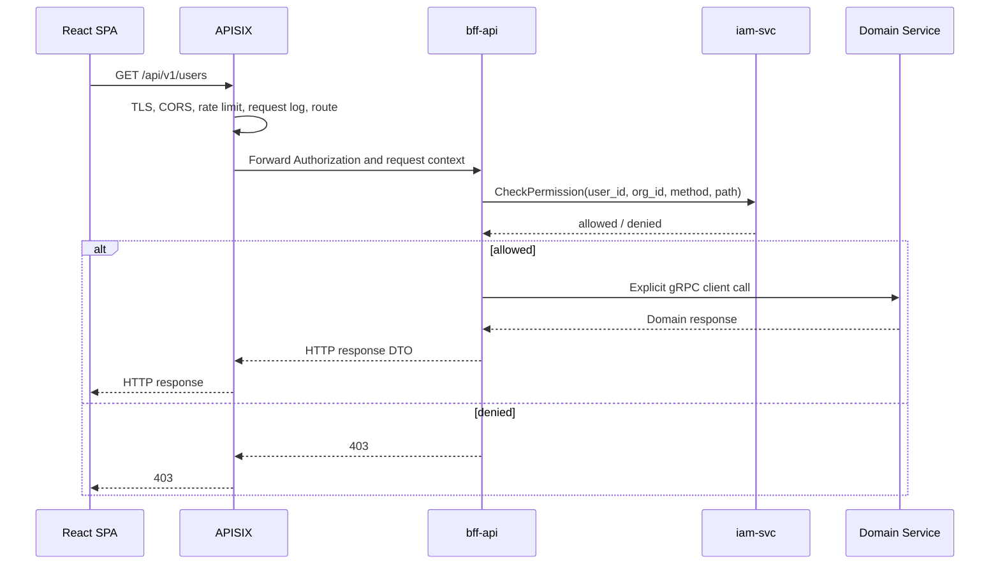

# Security and Auth Flow

The platform uses layered hybrid authorization.

## Decision

Use this split:

1. APISIX handles edge traffic protection and routing. It may do lightweight token pre-checks, but RBAC is not implemented in APISIX.
2. `bff-api` handles frontend API authorization orchestration.
3. `iam-svc` makes authorization decisions.
4. Domain services perform resource-level defensive checks when required by business rules.

## Login Flow

The access token should contain identity claims only:

- `user_id`
- `org_id`
- `session_id`
- `issuer`
- `expires_at`

It should not contain the full permission list. Permissions are queried from IAM and cached where appropriate.

## Protected Request Flow

## APISIX Responsibilities

APISIX should:

- Accept all external client traffic.
- Apply CORS, rate limiting, body size limits, and request logging.
- Route public auth endpoints and protected API endpoints to `bff-api`.
- Forward `Authorization`, request id, device, and tracing headers to `bff-api`.
- Optionally perform lightweight token pre-checks if operationally required, without making RBAC decisions.

APISIX should not:

- Encode page-specific permission decisions or call IAM for RBAC on client routes.
- Contain UI workflow orchestration.
- Call every domain service directly for client APIs.

## bff-api Responsibilities

`bff-api` should:

- Expose stable HTTP APIs for the frontend.
- Normalize request and response DTOs.
- Call IAM for endpoint-level permission checks.
- Batch permission checks for menu/bootstrap APIs.
- Call domain services through explicit typed gRPC clients.
- Forward user context to downstream services.

`bff-api` should not:

- Store identity or authorization source-of-truth data.
- Implement role-policy evaluation itself.
- Bypass IAM for protected operations.

## IAM Responsibilities

`iam-svc` should:

- Own RBAC and future ABAC data.
- Evaluate API permissions from `api_permissions`.
- Return allow/deny decisions with reasons.
- Provide user roles and permission summaries.
- Publish authorization-change events for cache invalidation.

## Header Contract

Internal requests from APISIX to `bff-api` should preserve these headers. `bff-api` can also derive user context by verifying the bearer token with `auth-svc`:

| Header | Meaning |
|---|---|
| `X-User-Id` | Authenticated user id. |
| `X-Org-Id` | Tenant or organization id. |
| `X-Session-Id` | Auth session id. |
| `X-User-Name` | Display or login name for logging only. |
| `Authorization` | Bearer token used by BFF when `X-User-*` context is absent. |
| `X-Request-Id` | Request correlation id. |

Downstream services should treat these as trusted only inside the platform network boundary.
