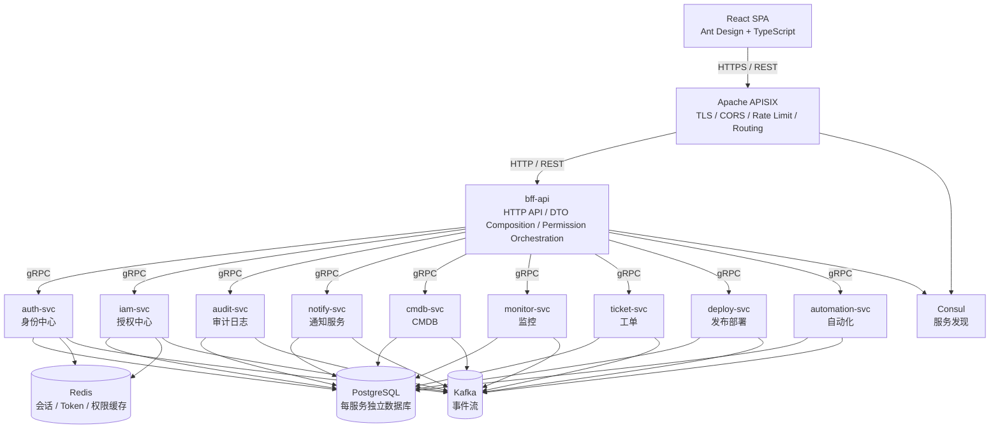

# 运维平台架构

这组文档定义运维平台的目标架构，是服务边界、请求流量、数据归属和阶段规划的依据。

## 架构原则

1. APISIX 是最外层边缘网关，也是唯一直接承接客户端流量的组件。
2. `bff-api` 是客户端 API 层，对 React SPA 暴露 HTTP 端点，并编排领域服务能力。
3. 领域服务同步调用使用 gRPC，异步协作使用 Kafka 事件流；HTTP 仅保留内部兼容、健康检查或调试入口。
4. 每个服务拥有自己的数据。服务可以引用 `user_id`、`org_id` 等外部标识，但不能跨库 JOIN。
5. 认证和授权分离：
   - `auth-svc` 回答“你是谁？”
   - `iam-svc` 回答“你能做什么？”
6. 授权从平台边界开始，但领域服务在敏感资源操作上仍可做资源级防御性校验。

## 运行时视图

## 请求流程

1. React SPA 通过 HTTPS 调用 APISIX。
2. APISIX 执行边缘策略：TLS 终止、CORS、限流、路由匹配和边缘流量治理。
3. APISIX 将客户端 API 流量转发给 `bff-api`。
4. `bff-api` 读取认证后的用户上下文，通过 `iam-svc` 做 API 级授权，并通过显式 gRPC 客户端调用领域服务。
5. 领域服务向 Kafka 发布业务事件。
6. `audit-svc` 和 `notify-svc` 消费相关事件。

## 文档索引

- [服务清单与边界](services.md)
- [安全与鉴权流程](security-and-auth.md)
- [数据归属](data-ownership.md)
- [通信与事件](communication-and-events.md)
- [部署与路线图](deployment-and-roadmap.md)

英文版本见 [../README.md](../README.md)。

