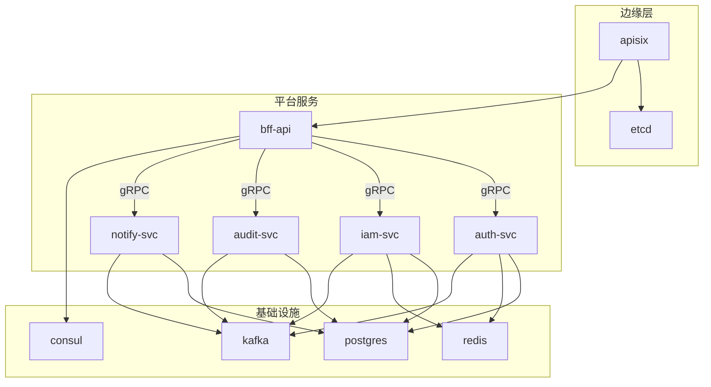

# 部署与路线图

## 部署拓扑

一期使用 Docker Compose。后续可以迁移到 Kubernetes，而不改变服务边界。



## 阶段路线图

| 阶段 | 服务 | 目标 |
|---:|---|---|
| 1 | `apisix`, `bff-api`, `auth-svc`, `iam-svc`, `audit-svc`, `notify-svc`, `web` | 身份、授权、审计、通知和前端 API 基座。 |
| 2 | `cmdb-svc` | 资产和拓扑管理。 |
| 3 | `monitor-svc` | 指标、告警规则和告警事件。 |
| 4 | `ticket-svc` | 工单、审批流和 SLA。 |
| 5 | `deploy-svc` | 应用发布和部署流水线编排。 |
| 6 | `automation-svc` | 脚本管理、批量执行和定时任务。 |

## 一期目标目录

```text
ops-platform/
|-- apisix/
|-- services/
|   |-- bff-api/
|   |-- auth-svc/
|   |-- iam-svc/
|   |-- audit-svc/
|   `-- notify-svc/
|-- pkg/
|   |-- proto/
|   |-- cache/
|   |-- database/
|   |-- jwt/
|   |-- kafka/
|   `-- ...
|-- web/
|-- deploy/
`-- docs/
    `-- architecture/
```

## Docker Compose 状态

当前 Compose 文件已经包含 APISIX、BFF 和一期领域服务。一期架构对齐状态：

- `bff-api` 已纳入 Compose 拓扑，并通过服务发现注册。
- APISIX 路由统一转发客户端 API 流量到 `bff-api`。
- BFF 负责调用 IAM 做授权编排。
- BFF 当前通过显式 gRPC 客户端调用一期领域服务。
- `bff-api` 和一期领域服务在 Compose 中只暴露到内部网络，客户端入口收口到 APISIX。

## 迁移规则

APISIX 中的客户端 API 路由统一转发到 `bff-api`。领域服务 HTTP 端点只作为内部兼容、健康检查或调试入口。当前目标状态是：

```text
Client -> APISIX -> bff-api -> gRPC domain services
```

内部健康检查、指标和管理路由可以保持服务级别，但不能作为公开客户端 API。

