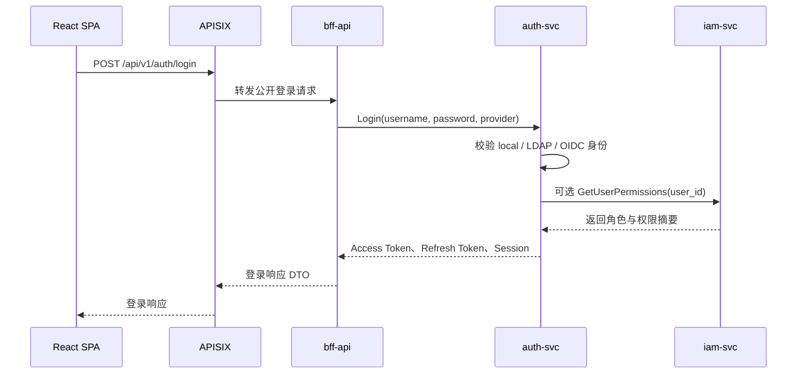
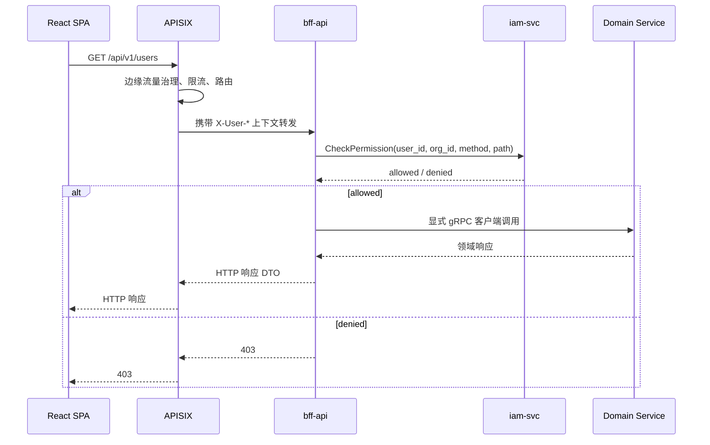

# 安全与鉴权流程

平台采用分层混合鉴权模型。

## 决策

鉴权职责按以下方式拆分：

1. APISIX 负责边缘流量治理和流量保护。
2. `bff-api` 负责前端 API 的权限编排。
3. `iam-svc` 负责做授权决策。
4. 领域服务在业务规则需要时执行资源级防御性校验。

## 登录流程

Access Token 只放身份声明：

- `user_id`
- `org_id`
- `session_id`
- `issuer`
- `expires_at`

Token 不放完整权限列表。权限从 IAM 查询，并在合适的位置缓存。

## 受保护请求流程

## APISIX 职责

APISIX 应该：

- 接收所有外部客户端流量。
- 执行 CORS、限流、请求体大小限制和请求日志。
- 校验受保护请求是否携带有效 Token。
- 通过内部请求头把认证后的用户上下文传给 `bff-api`。
- 将公开认证端点和受保护 API 端点路由到 `bff-api`。

APISIX 不应该：

- 编码页面级权限决策。
- 承载 UI 工作流编排。
- 为客户端 API 直接调用所有领域服务。

## bff-api 职责

`bff-api` 应该：

- 对前端暴露稳定 HTTP API。
- 统一请求和响应 DTO。
- 调用 IAM 做端点级权限检查。
- 为菜单和页面初始化 API 做批量权限检查。
- 通过显式类型化 gRPC 客户端调用领域服务。
- 向下游服务转发用户上下文。

`bff-api` 不应该：

- 存储身份或授权事实源数据。
- 自己实现角色策略求值。
- 绕过 IAM 执行受保护操作。

## IAM 职责

`iam-svc` 应该：

- 拥有 RBAC 和未来 ABAC 数据。
- 基于 `api_permissions` 执行 API 权限求值。
- 返回 allow/deny 决策和原因。
- 提供用户角色和权限摘要。
- 发布授权变更事件用于缓存失效。

## 请求头契约

APISIX 到 `bff-api` 的内部请求在边缘流量治理后使用以下请求头：

| Header | 含义 |
|---|---|
| `X-User-Id` | 已认证用户 ID。 |
| `X-Org-Id` | 租户或组织 ID。 |
| `X-Session-Id` | 认证会话 ID。 |
| `X-User-Name` | 展示名或登录名，仅用于日志。 |
| `X-Request-Id` | 请求关联 ID。 |

下游服务只应在平台内部网络边界内信任这些请求头。

